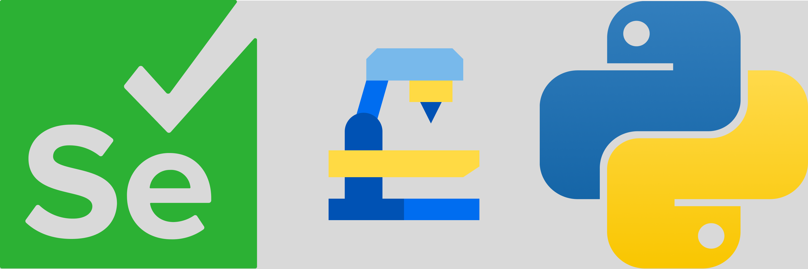

# Selenium-pytest-Framework

### A Hybrid Automation Framework for Testing an E-commerce Application Using Selenium, Pytest, Allure, Docker, Jenkins

----------

## Table of Contents

1.  [Project Overview](http://localhost:63342/markdownPreview/1232844968/markdown-preview-index-s6hkpc3v82vbsu4lv2lm9orbvd.html#project-overview)
2.  [Features](http://localhost:63342/markdownPreview/1232844968/markdown-preview-index-s6hkpc3v82vbsu4lv2lm9orbvd.html#features)
3.  [Technologies Used](http://localhost:63342/markdownPreview/1232844968/markdown-preview-index-s6hkpc3v82vbsu4lv2lm9orbvd.html#technologies-used)
4.  [Project Setup](http://localhost:63342/markdownPreview/1232844968/markdown-preview-index-s6hkpc3v82vbsu4lv2lm9orbvd.html#project-setup)
5.  [Running Tests Locally](http://localhost:63342/markdownPreview/1232844968/markdown-preview-index-s6hkpc3v82vbsu4lv2lm9orbvd.html#running-tests-locally)
6.  [Running Tests with Cloud Integration](http://localhost:63342/markdownPreview/1232844968/markdown-preview-index-s6hkpc3v82vbsu4lv2lm9orbvd.html#running-tests-with-cloud-integration)
7.  [Sample Reports](http://localhost:63342/markdownPreview/1232844968/markdown-preview-index-s6hkpc3v82vbsu4lv2lm9orbvd.html#sample-reports)
8.  [Folder Structure](http://localhost:63342/markdownPreview/1232844968/markdown-preview-index-s6hkpc3v82vbsu4lv2lm9orbvd.html#folder-structure)
9.  [Future Enhancements](http://localhost:63342/markdownPreview/1232844968/markdown-preview-index-s6hkpc3v82vbsu4lv2lm9orbvd.html#future-enhancements)
10.  [Contributors](http://localhost:63342/markdownPreview/1232844968/markdown-preview-index-s6hkpc3v82vbsu4lv2lm9orbvd.html#contributors)
11.  [Credits](http://localhost:63342/markdownPreview/1232844968/markdown-preview-index-s6hkpc3v82vbsu4lv2lm9orbvd.html#credits)
12.  [License](http://localhost:63342/markdownPreview/1232844968/markdown-preview-index-s6hkpc3v82vbsu4lv2lm9orbvd.html#license)

----------

## Project Overview

This project automates functional testing for a demo e-commerce web application  [https://tutorialsninja.com/demo](https://tutorialsninja.com/demo).  It is built on a robust hybrid automation framework using:

-   **Page Object Model (POM)**: For maintainable and reusable code.
-   **Selenium**: For web browser automation.
-   **Pytest**: For scalable and flexible test execution.
-   **Allure Reports**: For visually appealing test results.
-   **Selenium Grid (Docker)**: For parallel and cross-browser testing.
-   **Jenkins**: For CI/CD pipelines and scheduled test executions.
----------

## Features

-   **Functional Coverage**:
    -   User login tests
    -   Registration tests
    -   Product search tests
    -   Add to cart functionality
    -   Cart and checkout page validations
-   **Parallel Test Execution**  with  `pytest-xdist`.
-   **Allure Integration**  for detailed reporting.
-   **Dockerized Selenium Grid**  for distributed testing.
----------

## Technologies Used

-   **Programming Language**: Python
-   **Frameworks**: Pytest, Selenium, POM
-   **Reporting**: Allure Reports
-   **CI/CD**: Jenkins
-   **Containerization**: Docker and Docker Compose

----------

## Project Setup

### 1. Prerequisites

-   #### For Local System
    
    -   **Python 3.9+**  installed.
    -   **Node.js Installed**
        -   Allure CLI requires Node.js. Install it from the official  [Node.js website](https://nodejs.org/).
        -   Run the following command to install Allure CLI:
            
            
            
            `npm install -g allure-commandline` 
            
        -   Verify installation by running:
            
            
            
            `allure --version` 
            
    -   **Allure Command-line Tool**
        -   Add Allure CLI to your system path if necessary.
    -   **Python Dependencies**
        -   Install the required Python libraries using  `pip`:
            
            
            
            `pip install -r requirements.txt` 
            
-   
    -   **In Jenkins Global tool configurations**
        
        -   Add Java configuration:
            -   Name:  `Java 21`  (any name)
            -   Provide installation path (e.g.,  `/usr/lib/jvm/java-21-amazon-corretto`)
            -   Do not select "Install automatically" since Java is already installed
        -   Configure Allure CLI
            -   Name:  `Allure CLI`  (any name)
            -   Provide installation path (e.g.,  `/opt/allure`)

### 2. Clone the Repository

`https://github.com/NeelimaReddy123/selenium-pytest-framework/
remote:  cd selenium-pytest-framework` 

## Run Tests Locally

### 1. Setup in config.ini

set execution=parallel  &  run_environment=local

### 2. Run the test scripts in parallel mode()

`pytest tests/ --alluredir=reports -n 3` 

### 3. Generate Allure Reports

 ` allure generate reports --clean -o allure_report allure open allure_report` 

## Running Tests with Cloud Integration

### 1. Dockerized Selenium Grid

The docker-compose.yml file sets up a Selenium Hub and 3 browser nodes  (Chrome,  Firefox,  Edge)  for parallel testing.

### 2. Jenkins CI/CD

'Jenkinsfile'  is configured for installing python,pip,docker  &  all other dependencies using requirements.txt file,  then runs python scrips,  generate allure reports

### 3. Creating New Jenkins Pipeline Job

-   Navigate to the Jenkins dashboard and create a new pipeline job.
-   Configure the pipeline to use your GitHub repository & also link the Jenkinsfile
-   Set up build triggers like GitHub webhook or schedule (optional)
-   Run the build & pipeline will handle the execution of test scripts, Docker, and report generation.

## Folder Structure

selenium-pytest-framework/
├── assets/                    # Screenshots and report images for documentation
├── Configurations/           # Global environment variables and config.ini
├── pageObjects/            # Encapsulated web elements and page action methods
├── tests/                   # Pytest automation scripts and conftest.py fixtures
├── testData/               # External files (Excel/JSON) for data-driven testing
├── utilities/              # Custom logger, config readers, and driver handlers
├── docker-compose.yml      # Configuration for local Selenium Grid setup
├── Jenkinsfile             # Declarative pipeline instructions for CI/CD
├── requirements.txt        # Frozen Python package dependencies
└── README.md               # Project documentation

## Future Enhancements

-   Add more test cases for payment gateway integration.
-   Implement API testing for backend functionalities.

## Contributors

**Neelima Busireddy**  (Owner and Contributor)

## Credits

The  `docker-compose.yml`  file is adapted from  [Selenium's official GitHub repository](https://github.com/SeleniumHQ/docker-selenium).

## License

This project is licensed under the  [MIT License](file:///home/neelima/Documents/CloudEcomAutomation/LICENSE).  Feel free to use,  modify,  and distribute the code with attribution.